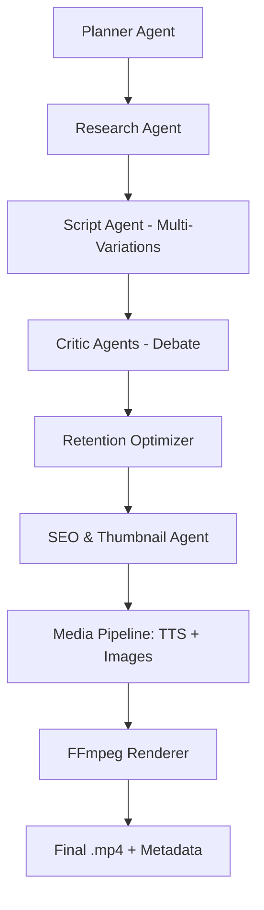

# 🎬 Agentic-AI-Based-Video-Creator

> **An autonomous, zero-budget AI production studio.** > This system leverages a multi-agent architecture to research, write, critique, and render high-retention YouTube Shorts without human intervention.

---

## 🚀 Overview

Unlike linear "Prompt-to-Video" tools, this project uses an **Agentic Workflow**. It doesn't just generate a script; it creates multiple variations, subjects them to a "Council of Critics," optimizes the hooks for retention, and renders the final media using a deterministic pipeline.

### **Core Pillars**

- **Multi-Agent Reasoning:** Specialized AI personas (Researchers, Scriptwriters, Critics).
- **Structured Outputs:** Pydantic-enforced JSON ensures the LLM never "breaks" the code.
- **Zero-Cost Stack:** Optimized for local execution via **Ollama**, **Piper TTS**, and **FFmpeg**.
- **Retention Engine:** Dedicated agents focused solely on the first 3 seconds (The Hook).

---

## 🧠 Architecture

The system follows a modular "Chain of Thought" execution:



---

## 📁 Project Structure

```text
Agentic-AI-Based-Video-Creator/
├── agents/                 # AI Persona logic (Planner, Critic, etc.)
├── media_pipeline/         # Media engines (Image Gen, TTS, FFmpeg)
├── orchestrator/           # The "Brain" (Engine & Memory management)
├── analytics/              # Performance & metadata logs
├── models/                 # Pydantic schemas for data validation
├── utils/                  # LLM API wrappers (Ollama/OpenAI)
└── main.py                 # System entry point

```

---

## 🛠️ Technical Stack

| Component           | Technology                                     |
| ------------------- | ---------------------------------------------- |
| **Orchestration**   | Python 3.10+ / Pydantic                        |
| **LLM (Brain)**     | Ollama (qwen2.5, llama3, or mistral)           |
| **Audio (TTS)**     | Piper (Fast, local, neural TTS)                |
| **Visuals**         | Stable Diffusion (Local) or Stable Horde (API) |
| **Video Rendering** | FFmpeg                                         |
| **Processing**      | Pillow / OpenCV                                |

---

## 📦 Installation

### 1. Clone & Environment

```bash
git clone https://github.com/ldhiman/Agentic-AI-Based-Video-Creater
cd Agentic-AI-Based-Video-Creator
python -m venv venv
source venv/bin/activate  # Windows: venv\Scripts\activate
pip install pydantic requests pillow google-api-python-client

```

### 2. LLM Setup (Local)

Install [Ollama](https://ollama.com/) and pull the model:

```bash
ollama pull qwen2.5:7b

```

### 3. Media Dependencies

- **FFmpeg:** Ensure `ffmpeg` is in your system PATH.
- **Piper TTS:** Download the [Piper executable](https://github.com/rhasspy/piper) and place your preferred `.onnx` voice model in the root directory.

---

## 🎬 How It Works

Run the entire pipeline with a single command:

```bash
python main.py

```

1. **Ideation:** The **Planner** selects a niche based on trending data.
2. **The Debate:** Two **Critics** analyze the script variations. If a script is "boring," it's sent back for a rewrite.
3. **Visual Planning:** The **Thumbnail Agent** creates high-CTR concepts while the **Image Agent** generates prompts.
4. **Production:** The **Media Pipeline** synthesizes voiceovers, generates images, and uses FFmpeg to overlay subtitles and transitions.
5. **Output:** All assets are saved in `/output/` alongside an `analytics_log.json`.

---

## 🔥 Why Agentic Architecture?

Standard AI video tools often produce "generic" content. This system mimics a human production team:

- **The Script Agent** focuses on storytelling.
- **The Retention Agent** focuses on keeping the user from scrolling.
- **The Critic Agent** ensures the facts are correct and the tone is consistent.

---

## 📈 Future Roadmap

- [ ] **YouTube Auto-Upload:** Integration with YouTube Data API.
- [ ] **Feedback Loop:** Scrape YouTube Studio analytics to "teach" the Planner what works.
- [ ] **Vector Memory:** Allow agents to remember previous "hits" to replicate success.

---

## ⚠ Disclaimer

This tool is for educational and experimental use. Users are responsible for ensuring their content complies with YouTube’s Community Guidelines and copyright laws.
